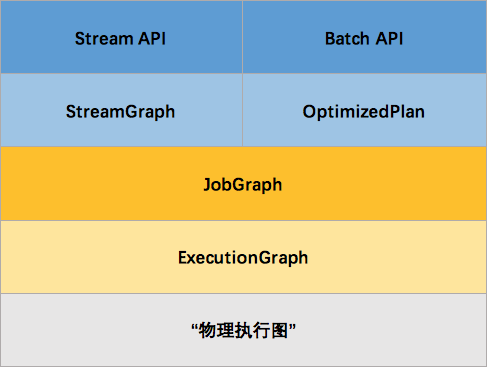
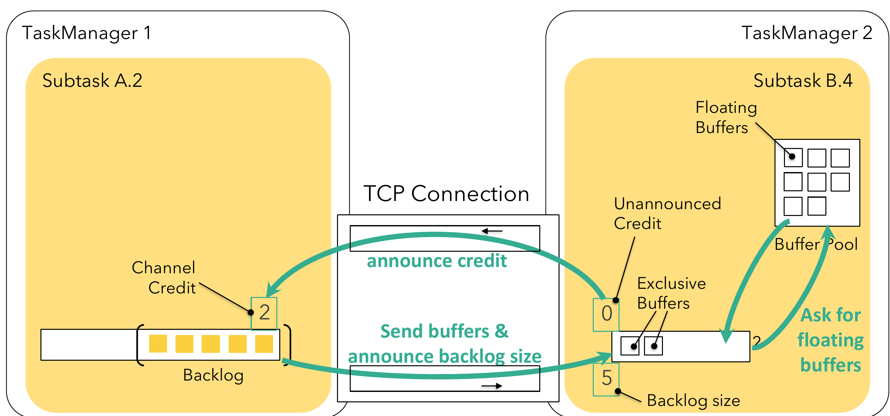

# flink内核分析

## flink架构和拓扑概览

### 架构

要了解一个系统，一般都是从架构开始。我们关心的问题是：系统部署成功后各个节点都启动了哪些服务，各个服务之间又是怎么交互和协调的。下方是 Flink 集群启动后架构图。


当 Flink 集群启动后，首先会启动一个 JobManager 和一个或多个的 TaskManager。由 Client 提交任务给 JobManager，JobManager 再调度任务到各个 TaskManager 去执行，然后 TaskManager 将心跳和统计信息汇报给 JobManager。TaskManager 之间以流的形式进行数据的传输。上述三者均为独立的 JVM 进程。

* Client 为提交 Job 的客户端，可以是运行在任何机器上（与 JobManager 环境连通即可）。提交 Job 后，Client 可以结束进程（Streaming的任务），也可以不结束并等待结果返回。
* JobManager 主要负责调度 Job 并协调 Task 做 checkpoint。从 Client 处接收到 Job 和 JAR 包等资源后，会生成优化后的执行计划，并以 Task 的单元调度到各个 TaskManager 去执行。
* TaskManager 在启动的时候就设置好了槽位数（Slot），每个 slot 能启动一个 Task，Task 为线程。从 JobManager 处接收需要部署的 Task，部署启动后，与自己的上游建立 Netty 连接，接收数据并处理。

### Graph

Flink 中的执行图可以分成四层：StreamGraph -> JobGraph -> ExecutionGraph -> 物理执行图。

* StreamGraph：是根据用户通过 Stream API 编写的代码生成的最初的图。用来表示程序的拓扑结构。
* JobGraph：StreamGraph经过优化后生成了 JobGraph，提交给 JobManager 的数据结构。主要的优化为，将多个符合条件的节点 chain 在一起作为一个节点，这样可以减少数据在节点之间流动所需要的序列化/反序列化/传输消耗。
* ExecutionGraph：JobManager 根据 JobGraph 生成ExecutionGraph。ExecutionGraph是JobGraph的并行化版本，是调度层最核心的数据结构。
* 物理执行图：JobManager 根据 ExecutionGraph 对 Job 进行调度后，在各个TaskManager 上部署 Task 后形成的“图”，并不是一个具体的数据结构。

例如上文中的2个并发度（Source为1个并发度）的 SocketTextStreamWordCount 四层执行图的演变过程如下图所示（点击查看大图）：


这里对一些名词进行简单的解释。

* StreamGraph：根据用户通过 Stream API 编写的代码生成的最初的图。
  * StreamNode：用来代表 operator 的类，并具有所有相关的属性，如并发度、入边和出边等。
  * StreamEdge：表示连接两个StreamNode的边。

* JobGraph：StreamGraph经过优化后生成了 JobGraph，提交给 JobManager 的数据结构。
  * JobVertex：经过优化后符合条件的多个StreamNode可能会chain在一起生成一个JobVertex，即一个JobVertex包含一个或多个operator，JobVertex的输入是JobEdge，输出是IntermediateDataSet。
  * IntermediateDataSet：表示JobVertex的输出，即经过operator处理产生的数据集。producer是JobVertex，consumer是JobEdge。
  * JobEdge：代表了job graph中的一条数据传输通道。source 是 IntermediateDataSet，target 是 JobVertex。即数据通过JobEdge由IntermediateDataSet传递给目标JobVertex。

* ExecutionGraph：JobManager 根据 JobGraph 生成ExecutionGraph。ExecutionGraph是JobGraph的并行化版本，是调度层最核心的数据结构。
  * ExecutionJobVertex：和JobGraph中的JobVertex一一对应。每一个ExecutionJobVertex都有和并发度一样多的 ExecutionVertex。
  * ExecutionVertex：表示ExecutionJobVertex的其中一个并发子任务，输入是ExecutionEdge，输出是IntermediateResultPartition。
  * IntermediateResult：和JobGraph中的IntermediateDataSet一一对应。一个IntermediateResult包含多个IntermediateResultPartition，其个数等于该operator的并发度。
  * IntermediateResultPartition：表示ExecutionVertex的一个输出分区，producer是ExecutionVertex，consumer是若干个ExecutionEdge。
  * ExecutionEdge：表示ExecutionVertex的输入，source是IntermediateResultPartition，target是ExecutionVertex。source和target都只能是一个。
  * Execution：是执行一个 ExecutionVertex 的一次尝试。当发生故障或者数据需要重算的情况下 ExecutionVertex 可能会有多个 ExecutionAttemptID。一个 Execution 通过 ExecutionAttemptID 来唯一标识。JM和TM之间关于 task 的部署和 task status 的更新都是通过 ExecutionAttemptID 来确定消息接受者。

* 物理执行图：JobManager 根据 ExecutionGraph 对 Job 进行调度后，在各个TaskManager 上部署 Task 后形成的“图”，并不是一个具体的数据结构。
  * Task：Execution被调度后在分配的 TaskManager 中启动对应的 Task。Task 包裹了具有用户执行逻辑的 operator。
  * ResultPartition：代表由一个Task的生成的数据，和ExecutionGraph中的IntermediateResultPartition一一对应。
  * ResultSubpartition：是ResultPartition的一个子分区。每个ResultPartition包含多个ResultSubpartition，其数目要由下游消费 Task 数和 DistributionPattern 来决定。
  * InputGate：代表Task的输入封装，和JobGraph中JobEdge一一对应。每个InputGate消费了一个或多个的ResultPartition。
  * InputChannel：每个InputGate会包含一个以上的InputChannel，和ExecutionGraph中的ExecutionEdge一一对应，也和ResultSubpartition一对一地相连，即一个InputChannel接收一个ResultSubpartition的输出。

那么 Flink 为什么要设计这4张图呢，其目的是什么呢？Spark 中也有多张图，数据依赖图以及物理执行的DAG。其目的都是一样的，就是解耦，每张图各司其职，每张图对应了 Job 不同的阶段，更方便做该阶段的事情。我们给出更完整的 Flink Graph 的层次图。



首先我们看到，JobGraph 之上除了 StreamGraph 还有 OptimizedPlan。OptimizedPlan 是由 Batch API 转换而来的。StreamGraph 是由 Stream API 转换而来的。为什么 API 不直接转换成 JobGraph？因为，Batch 和 Stream 的图结构和优化方法有很大的区别，比如 Batch 有很多执行前的预分析用来优化图的执行，而这种优化并不普适于 Stream，所以通过 OptimizedPlan 来做 Batch 的优化会更方便和清晰，也不会影响 Stream。JobGraph 的责任就是统一 Batch 和 Stream 的图，用来描述清楚一个拓扑图的结构，并且做了 chaining 的优化，chaining 是普适于 Batch 和 Stream 的，所以在这一层做掉。ExecutionGraph 的责任是方便调度和各个 tasks 状态的监控和跟踪，所以 ExecutionGraph 是并行化的 JobGraph。而“物理执行图”就是最终分布式在各个机器上运行着的tasks了。所以可以看到，这种解耦方式极大地方便了我们在各个层所做的工作，各个层之间是相互隔离的。

## 如何生成StreamGraph

现在我们将介绍 Flink 是如何根据用户用Stream API编写的程序，构造出一个代表拓扑结构的StreamGraph的。

StreamGraph 相关的代码主要在`org.apache.flink.streaming.api.graph`包中。构造StreamGraph的入口函数是`getStreamGraphGenerator().setJobName(jobName).generate()`。该函数会由触发程序执行的方法`StreamExecutionEnvironment.execute()`调用到。也就是说 StreamGraph 是在 Client 端构造的，这也意味着我们可以在本地通过调试观察 StreamGraph 的构造过程。

### Transformation

我们来看一下`generate()`函数的代码：

```java
	public StreamGraph generate() {
		streamGraph = new StreamGraph(executionConfig, checkpointConfig, savepointRestoreSettings);
		shouldExecuteInBatchMode = shouldExecuteInBatchMode(runtimeExecutionMode);
		configureStreamGraph(streamGraph);

		alreadyTransformed = new HashMap<>();

		for (Transformation<?> transformation: transformations) {
			transform(transformation);
		}

		final StreamGraph builtStreamGraph = streamGraph;

		alreadyTransformed.clear();
		alreadyTransformed = null;
		streamGraph = null;

		return builtStreamGraph;
	}
```

这个函数位于`StreamGraphGenerator.java`类中。当这个类进行实例化时，有一个关键参数：`List<Transformation<?>> transformations`。而上面的`generate`函数就对这个关键参数做了操作。`Transformation`代表了从一个或多个DataStream生成新DataStream的操作。DataStream的底层其实就是一个`Transformation`，描述了这个DataStream是怎么来的。

DataStream 上常见的 transformation 有 map、flatmap、filter等（见DataStream Transformation了解更多）。这些transformation会构造出一棵 Transformation 树，通过这棵树转换成 StreamGraph。比如 DataStream.map源码如下，其中SingleOutputStreamOperator为DataStream的子类：

```java
	public <R> SingleOutputStreamOperator<R> map(MapFunction<T, R> mapper) {
    // 通过java reflection抽出mapper的返回值类型
		TypeInformation<R> outType = TypeExtractor.getMapReturnTypes(clean(mapper), getType(),
				Utils.getCallLocationName(), true);

		return map(mapper, outType);
	}

	public <R> SingleOutputStreamOperator<R> map(MapFunction<T, R> mapper, TypeInformation<R> outputType) {
    // 返回一个新的DataStream，StreamMap 为 StreamOperator 的实现类
		return transform("Map", outputType, new StreamMap<>(clean(mapper)));
	}

	public <R> SingleOutputStreamOperator<R> transform(
			String operatorName,
			TypeInformation<R> outTypeInfo,
			OneInputStreamOperator<T, R> operator) {

		return doTransform(operatorName, outTypeInfo, SimpleOperatorFactory.of(operator));
	}

	protected <R> SingleOutputStreamOperator<R> doTransform(
			String operatorName,
			TypeInformation<R> outTypeInfo,
			StreamOperatorFactory<R> operatorFactory) {

		// read the output type of the input Transform to coax out errors about MissingTypeInfo
		transformation.getOutputType();

    // 新的transformation会连接上当前DataStream中的transformation，从而构建成一棵树
		OneInputTransformation<T, R> resultTransform = new OneInputTransformation<>(
				this.transformation,
				operatorName,
				operatorFactory,
				outTypeInfo,
				environment.getParallelism());

		@SuppressWarnings({"unchecked", "rawtypes"})
		SingleOutputStreamOperator<R> returnStream = new SingleOutputStreamOperator(environment, resultTransform);

    // 所有的transformation都会存到 env 中，调用execute时遍历该list生成StreamGraph
		getExecutionEnvironment().addOperator(resultTransform);

		return returnStream;
	}
```

从上方代码可以了解到，`map`转换将用户自定义的函数`MapFunction`包装到`StreamMap`这个Operator中，再将`StreamMap`包装到`OneInputTransformation`，最后该`transformation`存到`env`中，当调用`env.execute`时，遍历其中的`transformation`集合构造出`StreamGraph`。其分层实现如下图所示：


另外，并不是每一个`StreamTransformation`都会转换成 runtime 层中物理操作。有一些只是逻辑概念，比如 union、split/select、partition等。如下图所示的转换树，在运行时会优化成下方的操作图。


union、split/select、partition中的信息会被写入到 Source –> Map 的边中。通过源码也可以发现，UnionTransformation,SplitTransformation,SelectTransformation,PartitionTransformation由于不包含具体的操作所以都没有StreamOperator成员变量，而其他StreamTransformation的子类基本上都有。

### StreamOperator

DataStream 上的每一个 Transformation 都对应了一个 StreamOperator，StreamOperator是运行时的具体实现，会决定UDF(User-Defined Funtion)的调用方式。下图所示为 StreamOperator 的类图：


可以发现，所有实现类都继承了`AbstractStreamOperator`。另外除了 project 操作，其他所有可以执行UDF代码的实现类都继承自`AbstractUdfStreamOperator`，该类是封装了UDF的`StreamOperator`。UDF就是实现了`Function`接口的类，如`MapFunction`,`FilterFunction`。

### 生成 StreamGraph 的源码分析

我们通过在DataStream上做了一系列的转换（map、filter等）得到了Transformation集合，然后通过generate方法获得StreamGraph，该方法的源码如下：

```java
  // 对具体的一个transformation进行转换，转换成 StreamGraph 中的 StreamNode 和 StreamEdge
  // 返回值为该transform的id集合，通常大小为1个（除FeedbackTransformation）
	private Collection<Integer> transform(Transformation<?> transform) {
    // 跳过已经转换过的transformation
		if (alreadyTransformed.containsKey(transform)) {
			return alreadyTransformed.get(transform);
		}

		LOG.debug("Transforming " + transform);

		if (transform.getMaxParallelism() <= 0) {

			// if the max parallelism hasn't been set, then first use the job wide max parallelism
			// from the ExecutionConfig.
			int globalMaxParallelismFromConfig = executionConfig.getMaxParallelism();
			if (globalMaxParallelismFromConfig > 0) {
				transform.setMaxParallelism(globalMaxParallelismFromConfig);
			}
		}

    // 至少调用一次，如果获取不到输出类型，触发MissingTypeInfo异常。防御式编程。
		transform.getOutputType();

    // 获取翻译器，将map之类的算子翻译成OneInputTransformation
		@SuppressWarnings("unchecked")
		final TransformationTranslator<?, Transformation<?>> translator =
				(TransformationTranslator<?, Transformation<?>>) translatorMap.get(transform.getClass());

		Collection<Integer> transformedIds;
		if (translator != null) {
      // 执行翻译操作
			transformedIds = translate(translator, transform);
		} else {
			transformedIds = legacyTransform(transform);
		}

    // 将处理过的转换操作加入已经转换过的集合中，不会重复处理
		if (!alreadyTransformed.containsKey(transform)) {
			alreadyTransformed.put(transform, transformedIds);
		}

		return transformedIds;
	}

	private Collection<Integer> translate(
			final TransformationTranslator<?, Transformation<?>> translator,
			final Transformation<?> transform) {
		checkNotNull(translator);
		checkNotNull(transform);

		final List<Collection<Integer>> allInputIds = getParentInputIds(transform.getInputs());

		// the recursive call might have already transformed this
		if (alreadyTransformed.containsKey(transform)) {
			return alreadyTransformed.get(transform);
		}

    // 确定任务槽的共享组，多个任务槽可能在一个组里
		final String slotSharingGroup = determineSlotSharingGroup(
				transform.getSlotSharingGroup(),
				allInputIds.stream()
						.flatMap(Collection::stream)
						.collect(Collectors.toList()));

		final TransformationTranslator.Context context = new ContextImpl(
				this, streamGraph, slotSharingGroup, configuration);

    // 由于我们是流式程序，所以会选择流式翻译器
		return shouldExecuteInBatchMode
				? translator.translateForBatch(transform, context)
				: translator.translateForStreaming(transform, context);
	}
```

以下是流式翻译器的代码：

```java
	@Override
	public Collection<Integer> translateForStreaming(final T transformation, final Context context) {
		checkNotNull(transformation);
		checkNotNull(context);

		final Collection<Integer> transformedIds =
        // 点击以下函数，进入后面的代码
				translateForStreamingInternal(transformation, context);
		configure(transformation, context);

		return transformedIds;
	}

	@Override
	public Collection<Integer> translateForStreamingInternal(
			final OneInputTransformation<IN, OUT> transformation,
			final Context context) {
    // 点击函数translateInternal
		return translateInternal(transformation,
			transformation.getOperatorFactory(),
			transformation.getInputType(),
			transformation.getStateKeySelector(),
			transformation.getStateKeyType(),
			context
		);
	}

	protected Collection<Integer> translateInternal(
			final Transformation<OUT> transformation,
			final StreamOperatorFactory<OUT> operatorFactory,
			final TypeInformation<IN> inputType,
			@Nullable final KeySelector<IN, ?> stateKeySelector,
			@Nullable final TypeInformation<?> stateKeyType,
			final Context context) {
		checkNotNull(transformation);
		checkNotNull(operatorFactory);
		checkNotNull(inputType);
		checkNotNull(context);

		final StreamGraph streamGraph = context.getStreamGraph();
		final String slotSharingGroup = context.getSlotSharingGroup();
		final int transformationId = transformation.getId();
		final ExecutionConfig executionConfig = streamGraph.getExecutionConfig();

    // 添加 StreamNode
		streamGraph.addOperator(
			transformationId,
			slotSharingGroup,
			transformation.getCoLocationGroupKey(),
			operatorFactory,
			inputType,
			transformation.getOutputType(),
			transformation.getName());

		if (stateKeySelector != null) {
			TypeSerializer<?> keySerializer = stateKeyType.createSerializer(executionConfig);
			streamGraph.setOneInputStateKey(transformationId, stateKeySelector, keySerializer);
		}

		int parallelism = transformation.getParallelism() != ExecutionConfig.PARALLELISM_DEFAULT
			? transformation.getParallelism()
			: executionConfig.getParallelism();
		streamGraph.setParallelism(transformationId, parallelism);
		streamGraph.setMaxParallelism(transformationId, transformation.getMaxParallelism());

		final List<Transformation<?>> parentTransformations = transformation.getInputs();
		checkState(
			parentTransformations.size() == 1,
			"Expected exactly one input transformation but found " + parentTransformations.size());

    // 添加StreamEdge
		for (Integer inputId: context.getStreamNodeIds(parentTransformations.get(0))) {
			streamGraph.addEdge(inputId, transformationId, 0);
		}

		return Collections.singleton(transformationId);
	}
```

通过transform构造出StreamNode，最后与上游的transform进行连接，构造出StreamNode。

最后再来看下对逻辑转换（partition、union等）的处理，如下是`PartitionTransformationTranslator`中的源码，用来进行partion转换：

```java
	@Override
	protected Collection<Integer> translateForStreamingInternal(
			final PartitionTransformation<OUT> transformation,
			final Context context) {
    // 点击下面的函数
		return translateInternal(transformation, context);
	}

	private Collection<Integer> translateInternal(
			final PartitionTransformation<OUT> transformation,
			final Context context) {
		checkNotNull(transformation);
		checkNotNull(context);

		final StreamGraph streamGraph = context.getStreamGraph();

		final List<Transformation<?>> parentTransformations = transformation.getInputs();
		checkState(
				parentTransformations.size() == 1,
				"Expected exactly one input transformation but found " + parentTransformations.size());
		final Transformation<?> input = parentTransformations.get(0);

		List<Integer> resultIds = new ArrayList<>();

		for (Integer inputId: context.getStreamNodeIds(input)) {
      // 生成一个新的虚拟id
			final int virtualId = Transformation.getNewNodeId();
      // 添加一个虚拟分区节点，不会生成 StreamNode
			streamGraph.addVirtualPartitionNode(
					inputId,
					virtualId,
					transformation.getPartitioner(),
					transformation.getShuffleMode());
			resultIds.add(virtualId);
		}
		return resultIds;
	}
```

对partition的转换没有生成具体的StreamNode和StreamEdge，而是添加一个虚节点。当partition的下游transform（如map）添加edge时（调用StreamGraph.addEdge），会把partition信息写入到edge中。如StreamGraph.addEdgeInternal所示：

```java
	public void addEdge(Integer upStreamVertexID, Integer downStreamVertexID, int typeNumber) {
		addEdgeInternal(upStreamVertexID,
				downStreamVertexID,
				typeNumber,
				null,
				new ArrayList<String>(),
				null,
				null);

	}

	private void addEdgeInternal(Integer upStreamVertexID,
			Integer downStreamVertexID,
			int typeNumber,
			StreamPartitioner<?> partitioner,
			List<String> outputNames,
			OutputTag outputTag,
			ShuffleMode shuffleMode) {

    // 判断一下上游节点是不是在虚拟侧输出节点中，如果在，递归调用来添加边，并传入侧输出的信息
		if (virtualSideOutputNodes.containsKey(upStreamVertexID)) {
      // 上游节点的ID
			int virtualId = upStreamVertexID;
			upStreamVertexID = virtualSideOutputNodes.get(virtualId).f0;
			if (outputTag == null) {
				outputTag = virtualSideOutputNodes.get(virtualId).f1;
			}
			addEdgeInternal(upStreamVertexID, downStreamVertexID, typeNumber, partitioner, null, outputTag, shuffleMode);
      // 当上游是partition时，递归调用，并传入partitioner信息
		} else if (virtualPartitionNodes.containsKey(upStreamVertexID)) {
      // 上游节点的id
			int virtualId = upStreamVertexID;
			upStreamVertexID = virtualPartitionNodes.get(virtualId).f0;
			if (partitioner == null) {
				partitioner = virtualPartitionNodes.get(virtualId).f1;
			}
			shuffleMode = virtualPartitionNodes.get(virtualId).f2;
			addEdgeInternal(upStreamVertexID, downStreamVertexID, typeNumber, partitioner, outputNames, outputTag, shuffleMode);
		} else {
      // 真正构建StreamEdge
			StreamNode upstreamNode = getStreamNode(upStreamVertexID);
			StreamNode downstreamNode = getStreamNode(downStreamVertexID);

			// If no partitioner was specified and the parallelism of upstream and downstream
			// operator matches use forward partitioning, use rebalance otherwise.
      // 未指定partitioner的话，会为其选择 forward 或 rebalance 分区。
			if (partitioner == null && upstreamNode.getParallelism() == downstreamNode.getParallelism()) {
				partitioner = new ForwardPartitioner<Object>();
			} else if (partitioner == null) {
				partitioner = new RebalancePartitioner<Object>();
			}

      // 健康检查， forward 分区必须要上下游的并发度一致，防御式编程
			if (partitioner instanceof ForwardPartitioner) {
				if (upstreamNode.getParallelism() != downstreamNode.getParallelism()) {
					throw new UnsupportedOperationException("Forward partitioning does not allow " +
							"change of parallelism. Upstream operation: " + upstreamNode + " parallelism: " + upstreamNode.getParallelism() +
							", downstream operation: " + downstreamNode + " parallelism: " + downstreamNode.getParallelism() +
							" You must use another partitioning strategy, such as broadcast, rebalance, shuffle or global.");
				}
			}

			if (shuffleMode == null) {
				shuffleMode = ShuffleMode.UNDEFINED;
			}

      // 创建 StreamEdge
			StreamEdge edge = new StreamEdge(upstreamNode, downstreamNode, typeNumber,
				partitioner, outputTag, shuffleMode);

      // 将该 StreamEdge 添加到上游的输出，下游的输入
			getStreamNode(edge.getSourceId()).addOutEdge(edge);
			getStreamNode(edge.getTargetId()).addInEdge(edge);
		}
	}
```

### 实例讲解

如下程序，是一个从 Source 中按行切分成单词并过滤输出的简单流程序，其中包含了逻辑转换：随机分区shuffle。我们会分析该程序是如何生成StreamGraph的。

```java
DataStream<String> text = env.socketTextStream(hostName, port);
text.flatMap(new LineSplitter()).shuffle().filter(new HelloFilter()).print();
```

首先会在env中生成一棵transformation树，用List<Transformation<?>>保存。其结构图如下：


其中符号*为input指针，指向上游的transformation，从而形成了一棵transformation树。然后，通过调用StreamGraphGenerator.generate(env, transformations)来生成StreamGraph。自底向上递归调用每一个transformation，也就是说处理顺序是Source->FlatMap->Shuffle->Filter->Sink。


如上图所示：

1. 首先处理的Source，生成了Source的StreamNode。
2. 然后处理的FlatMap，生成了FlatMap的StreamNode，并生成StreamEdge连接上游Source和FlatMap。由于上下游的并发度不一样（1:4），所以此处是Rebalance分区。
3. 然后处理的Shuffle，由于是逻辑转换，并不会生成实际的节点。将partitioner信息暂存在virtuaPartitionNodes中。
4. 在处理Filter时，生成了Filter的StreamNode。发现上游是shuffle，找到shuffle的上游FlatMap，创建StreamEdge与Filter相连。并把ShufflePartitioner的信息写到StreamEdge中。
5. 最后处理Sink，创建Sink的StreamNode，并生成StreamEdge与上游Filter相连。由于上下游并发度一样（4:4），所以此处选择 Forward 分区。

最后可以通过 UI可视化 来观察得到的 StreamGraph。


## 如何生成JobGraph

本章将主要介绍 Flink 是如何将 StreamGraph 转换成 JobGraph 的。根据用户用Stream API编写的程序，构造出一个代表拓扑结构的StreamGraph的。以 WordCount 为例，转换图如下图所示：


StreamGraph 和 JobGraph 都是在 Client 端生成的，也就是说我们可以在 IDE 中通过断点调试观察 StreamGraph 和 JobGraph 的生成过程。

JobGraph 的相关数据结构主要在`org.apache.flink.runtime.jobgraph`包中。构造 JobGraph 的代码主要集中在 StreamingJobGraphGenerator 类中，入口函数是 StreamingJobGraphGenerator.createJobGraph()。我们首先来看下StreamingJobGraphGenerator的核心源码：

```java
public class StreamingJobGraphGenerator {
  private final StreamGraph streamGraph;

  // id -> JobVertex 键值对
  private final Map<Integer, JobVertex> jobVertices;
  private JobGraph jobGraph;

  // 已经构建的JobVertex的id集合
  private final Collection<Integer> builtVertices;

  // 物理边集合（排除了chain内部的边）, 按创建顺序排序
  private final List<StreamEdge> physicalEdgesInOrder;

  // 保存chain信息，部署时用来构建 OperatorChain，startNodeId -> (currentNodeId -> StreamConfig)
  private final Map<Integer, Map<Integer, StreamConfig>> chainedConfigs;

  // 所有节点的配置信息，id -> StreamConfig
  private final Map<Integer, StreamConfig> vertexConfigs;

  // 保存每个节点的名字，id -> chainedName
  private final Map<Integer, String> chainedNames;

  // 根据 StreamGraph，生成 JobGraph
	private JobGraph createJobGraph() {
		preValidate();

		// make sure that all vertices start immediately
    // streaming 模式下，调度模式是所有节点（vertices）一起启动
		jobGraph.setScheduleMode(streamGraph.getScheduleMode());
		jobGraph.enableApproximateLocalRecovery(streamGraph.getCheckpointConfig().isApproximateLocalRecoveryEnabled());

		// Generate deterministic hashes for the nodes in order to identify them across
		// submission iff they didn't change.
    // 广度优先遍历 StreamGraph 并且为每个SteamNode生成hash id，
    // 保证如果提交的拓扑没有改变，则每次生成的hash都是一样的
		Map<Integer, byte[]> hashes = defaultStreamGraphHasher.traverseStreamGraphAndGenerateHashes(streamGraph);

		// Generate legacy version hashes for backwards compatibility
		List<Map<Integer, byte[]>> legacyHashes = new ArrayList<>(legacyStreamGraphHashers.size());
		for (StreamGraphHasher hasher : legacyStreamGraphHashers) {
			legacyHashes.add(hasher.traverseStreamGraphAndGenerateHashes(streamGraph));
		}

    // 最重要的函数，生成JobVertex，JobEdge等，并尽可能地将多个节点chain在一起
		setChaining(hashes, legacyHashes);

    // 将每个JobVertex的入边集合也序列化到该JobVertex的StreamConfig中
    // (出边集合已经在setChaining的时候写入了)
		setPhysicalEdges();

    // 根据group name，为每个 JobVertex 指定所属的 SlotSharingGroup 
    // 以及针对 Iteration的头尾设置  CoLocationGroup
		setSlotSharingAndCoLocation();

		setManagedMemoryFraction(
			Collections.unmodifiableMap(jobVertices),
			Collections.unmodifiableMap(vertexConfigs),
			Collections.unmodifiableMap(chainedConfigs),
			id -> streamGraph.getStreamNode(id).getManagedMemoryOperatorScopeUseCaseWeights(),
			id -> streamGraph.getStreamNode(id).getManagedMemorySlotScopeUseCases());

    // 配置checkpoint
		configureCheckpointing();

		jobGraph.setSavepointRestoreSettings(streamGraph.getSavepointRestoreSettings());

		JobGraphUtils.addUserArtifactEntries(streamGraph.getUserArtifacts(), jobGraph);

		// set the ExecutionConfig last when it has been finalized
    // 将 StreamGraph 的 ExecutionConfig 序列化到 JobGraph 的配置中
		try {
			jobGraph.setExecutionConfig(streamGraph.getExecutionConfig());
		}
		catch (IOException e) {
			throw new IllegalConfigurationException("Could not serialize the ExecutionConfig." +
					"This indicates that non-serializable types (like custom serializers) were registered");
		}

		return jobGraph;
	}

}
```

StreamingJobGraphGenerator的成员变量都是为了辅助生成最终的JobGraph。`createJobGraph()`函数的逻辑也很清晰，首先为所有节点生成一个唯一的hash id，如果节点在多次提交中没有改变（包括并发度、上下游等），那么这个id就不会改变，这主要用于故障恢复。这里我们不能用 StreamNode.id来代替，因为这是一个从1开始的静态计数变量，同样的Job可能会得到不一样的id，如下代码示例的两个job是完全一样的，但是source的id却不一样了。然后就是最关键的chaining处理，和生成JobVetex、JobEdge等。之后就是写入各种配置相关的信息。

```java
// 范例1：A.id=1  B.id=2
DataStream<String> A = ...
DataStream<String> B = ...
A.union(B).print();
// 范例2：A.id=2  B.id=1
DataStream<String> B = ...
DataStream<String> A = ...
A.union(B).print();
```

下面具体分析下关键函数 setChaining 的实现：

```java
	private void setChaining(Map<Integer, byte[]> hashes, List<Map<Integer, byte[]>> legacyHashes) {
		// we separate out the sources that run as inputs to another operator (chained inputs)
		// from the sources that needs to run as the main (head) operator.
		final Map<Integer, OperatorChainInfo> chainEntryPoints = buildChainedInputsAndGetHeadInputs(hashes, legacyHashes);
		final Collection<OperatorChainInfo> initialEntryPoints = new ArrayList<>(chainEntryPoints.values());

		// iterate over a copy of the values, because this map gets concurrently modified
    // 从source开始建立 node chains
		for (OperatorChainInfo info : initialEntryPoints) {
			createChain(
					info.getStartNodeId(),
					1,  // operators start at position 1 because 0 is for chained source inputs
					info,
					chainEntryPoints);
		}
	}

	private List<StreamEdge> createChain(
			final Integer currentNodeId,
			final int chainIndex,
			final OperatorChainInfo chainInfo,
			final Map<Integer, OperatorChainInfo> chainEntryPoints) {

		Integer startNodeId = chainInfo.getStartNodeId();
		if (!builtVertices.contains(startNodeId)) {

      // 过渡用的出边集合, 用来生成最终的 JobEdge, 注意不包括 chain 内部的边
			List<StreamEdge> transitiveOutEdges = new ArrayList<StreamEdge>();

			List<StreamEdge> chainableOutputs = new ArrayList<StreamEdge>();
			List<StreamEdge> nonChainableOutputs = new ArrayList<StreamEdge>();

			StreamNode currentNode = streamGraph.getStreamNode(currentNodeId);

      // 将当前节点的出边分成 chainable 和 nonChainable 两类
			for (StreamEdge outEdge : currentNode.getOutEdges()) {
				if (isChainable(outEdge, streamGraph)) {
					chainableOutputs.add(outEdge);
				} else {
					nonChainableOutputs.add(outEdge);
				}
			}

      //==> 递归调用
			for (StreamEdge chainable : chainableOutputs) {
				transitiveOutEdges.addAll(
						createChain(chainable.getTargetId(), chainIndex + 1, chainInfo, chainEntryPoints));
			}

			for (StreamEdge nonChainable : nonChainableOutputs) {
				transitiveOutEdges.add(nonChainable);
				createChain(
						nonChainable.getTargetId(),
						1, // operators start at position 1 because 0 is for chained source inputs
						chainEntryPoints.computeIfAbsent(
							nonChainable.getTargetId(),
							(k) -> chainInfo.newChain(nonChainable.getTargetId())),
						chainEntryPoints);
			}

      // 生成当前节点的显示名，如："Keyed Aggregation -> Sink: Unnamed"
			chainedNames.put(currentNodeId, createChainedName(currentNodeId, chainableOutputs, Optional.ofNullable(chainEntryPoints.get(currentNodeId))));
			chainedMinResources.put(currentNodeId, createChainedMinResources(currentNodeId, chainableOutputs));
			chainedPreferredResources.put(currentNodeId, createChainedPreferredResources(currentNodeId, chainableOutputs));

			OperatorID currentOperatorId = chainInfo.addNodeToChain(currentNodeId, chainedNames.get(currentNodeId));

			if (currentNode.getInputFormat() != null) {
				getOrCreateFormatContainer(startNodeId).addInputFormat(currentOperatorId, currentNode.getInputFormat());
			}

			if (currentNode.getOutputFormat() != null) {
				getOrCreateFormatContainer(startNodeId).addOutputFormat(currentOperatorId, currentNode.getOutputFormat());
			}

      // 如果当前节点是起始节点, 则直接创建 JobVertex 并返回 StreamConfig, 否则先创建一个空的 StreamConfig
      // createJobVertex 函数就是根据 StreamNode 创建对应的 JobVertex, 并返回了空的 StreamConfig
			StreamConfig config = currentNodeId.equals(startNodeId)
					? createJobVertex(startNodeId, chainInfo)
					: new StreamConfig(new Configuration());

      // 设置 JobVertex 的 StreamConfig, 基本上是序列化 StreamNode 中的配置到 StreamConfig 中.
      // 其中包括 序列化器, StreamOperator, Checkpoint 等相关配置
			setVertexConfig(currentNodeId, config, chainableOutputs, nonChainableOutputs, chainInfo.getChainedSources());

			if (currentNodeId.equals(startNodeId)) {
        // 如果是chain的起始节点。（不是chain中的节点，也会被标记成 chain start）
				config.setChainStart();
        // 我们也会把物理出边写入配置, 部署时会用到
				config.setChainIndex(chainIndex);
				config.setOperatorName(streamGraph.getStreamNode(currentNodeId).getOperatorName());

        // 将当前节点(headOfChain)与所有出边相连
				for (StreamEdge edge : transitiveOutEdges) {
          // 通过StreamEdge构建出JobEdge，创建IntermediateDataSet，用来将JobVertex和JobEdge相连
					connect(startNodeId, edge);
				}

				config.setOutEdgesInOrder(transitiveOutEdges);
        // 将chain中所有子节点的StreamConfig写入到 headOfChain 节点的 CHAINED_TASK_CONFIG 配置中
				config.setTransitiveChainedTaskConfigs(chainedConfigs.get(startNodeId));

			} else {
        // 如果是 chain 中的子节点

				chainedConfigs.computeIfAbsent(startNodeId, k -> new HashMap<Integer, StreamConfig>());

				config.setChainIndex(chainIndex);
				StreamNode node = streamGraph.getStreamNode(currentNodeId);
				config.setOperatorName(node.getOperatorName());
        // 将当前节点的StreamConfig添加到该chain的config集合中
				chainedConfigs.get(startNodeId).put(currentNodeId, config);
			}

			config.setOperatorID(currentOperatorId);

			if (chainableOutputs.isEmpty()) {
				config.setChainEnd();
			}
      // 返回连往chain外部的出边集合
			return transitiveOutEdges;

		} else {
			return new ArrayList<>();
		}
	}
```

每个 JobVertex 都会对应一个可序列化的 StreamConfig, 用来发送给 JobManager 和 TaskManager。最后在 TaskManager 中起 Task 时,需要从这里面反序列化出所需要的配置信息, 其中就包括了含有用户代码的StreamOperator。

setChaining会对source调用createChain方法，该方法会递归调用下游节点，从而构建出node chains。createChain会分析当前节点的出边，根据Operator Chains中的chainable条件，将出边分成chainalbe和noChainable两类，并分别递归调用自身方法。之后会将StreamNode中的配置信息序列化到StreamConfig中。如果当前不是chain中的子节点，则会构建 JobVertex 和 JobEdge相连。如果是chain中的子节点，则会将StreamConfig添加到该chain的config集合中。一个node chains，除了 headOfChain node会生成对应的 JobVertex，其余的nodes都是以序列化的形式写入到StreamConfig中，并保存到headOfChain的 CHAINED_TASK_CONFIG 配置项中。直到部署时，才会取出并生成对应的ChainOperators，具体过程请见理解 Operator Chains。

本章主要对 Flink 中将 StreamGraph 转变成 JobGraph 的核心源码进行了分析。思想还是很简单的，StreamNode 转成 JobVertex，StreamEdge 转成 JobEdge，JobEdge 和 JobVertex 之间创建 IntermediateDataSet 来连接。关键点在于将多个 SteamNode chain 成一个 JobVertex的过程，这部分源码比较绕，有兴趣的同学可以结合源码单步调试分析。下一章将会介绍 JobGraph 提交到 JobManager 后是如何转换成分布式化的 ExecutionGraph 的。

## 如何生成 ExecutionGraph

在前两章中介绍的 StreamGraph 和 JobGraph 都是在 client 端生成的，本章将会讲述 JobGraph 是如何转换成 ExecutionGraph 的。当 JobGraph 从 client 端提交到 JobManager 端后，JobManager 会根据 JobGraph 生成对应的 ExecutionGraph，ExecutionGraph 是 Flink 作业调度时使用到的核心数据结构，它包含每一个并行的 task、每一个 intermediate stream 以及它们之间的关系，本篇将会详细分析一下 JobGraph 转换为 ExecutionGraph 的流程。

### Create ExecutionGraph 的整体流程

当用户向一个 Flink 集群提交一个作业后，JobManager 会接收到 Client 相应的请求，JobManager 会先做一些初始化相关的操作（也就是 JobGraph 到 ExecutionGraph 的转化），当这个转换完成后，才会根据 ExecutionGraph 真正在分布式环境中调度当前这个作业，而 JobManager 端处理的整体流程如下：

上图是一个作业提交后，在 JobManager 端的处理流程，本篇文章主要聚焦于 ExecutionGraph 的生成过程，也就是图中的红色节点，即 ExecutionGraphBuilder 的 buildGraph() 方法，这个方法就是根据 JobGraph 及相关的配置来创建 ExecutionGraph 对象的核心方法。

### 具体实现逻辑

#### 基本概念

ExecutionGraph 引入了几个基本概念，先简单介绍一下这些概念，对于理解 ExecutionGraph 有较大帮助：

* ExecutionJobVertex: 在 ExecutionGraph 中，节点对应的是 ExecutionJobVertex，它是与 JobGraph 中的 JobVertex 一一对应，实际上每个 ExexutionJobVertex 也都是由一个 JobVertex 生成；
* ExecutionVertex: 在 ExecutionJobVertex 中有一个 taskVertices 变量，它是 ExecutionVertex 类型的数组，数组的大小就是这个 JobVertex 的并发度，在创建 ExecutionJobVertex 对象时，会创建相同并发度梳理的 ExecutionVertex 对象，在真正调度时，一个 ExecutionVertex 实际就是一个 task，它是 ExecutionJobVertex 并行执行的一个子任务；
* Execution: Execution 是对 ExecutionVertex 的一次执行，通过 ExecutionAttemptId 来唯一标识，一个 ExecutionVertex 在某些情况下可能会执行多次，比如遇到失败的情况或者该 task 的数据需要重新计算时；
* IntermediateResult: 在 JobGraph 中用 IntermediateDataSet 表示 JobVertex 的输出 stream，一个 JobGraph 可能会有多个输出 stream，在 ExecutionGraph 中，与之对应的就是 IntermediateResult 对象；
* IntermediateResultPartition: 由于 ExecutionJobVertex 可能有多个并行的子任务，所以每个 IntermediateResult 可能就有多个生产者，每个生产者的在相应的 IntermediateResult 上的输出对应一个 IntermediateResultPartition 对象，IntermediateResultPartition 表示的是 ExecutionVertex 的一个输出分区；
* ExecutionEdge: ExecutionEdge 表示 ExecutionVertex 的输入，通过 ExecutionEdge 将 ExecutionVertex 和 IntermediateResultPartition 连接起来，进而在 ExecutionVertex 和 IntermediateResultPartition 之间建立联系。

从这些基本概念中，也可以看出以下几点：

1. 由于每个 JobVertex 可能有多个 IntermediateDataSet，所以每个 ExecutionJobVertex 可能有多个 IntermediateResult，因此，每个 ExecutionVertex 也可能会包含多个 IntermediateResultPartition；
2. ExecutionEdge 这里主要的作用是把 ExecutionVertex 和 IntermediateResultPartition 连接起来，表示它们之间的连接关系。

#### 实现细节

ExecutionGraph 的生成是在 ExecutionGraphBuilder 的 buildGraph() 方法中实现的：

```java
	public static ExecutionGraph buildGraph(
		@Nullable ExecutionGraph prior,
		JobGraph jobGraph,
		Configuration jobManagerConfig,
		ScheduledExecutorService futureExecutor,
		Executor ioExecutor,
		SlotProvider slotProvider,
		ClassLoader classLoader,
		CheckpointRecoveryFactory recoveryFactory,
		Time rpcTimeout,
		RestartStrategy restartStrategy,
		MetricGroup metrics,
		BlobWriter blobWriter,
		Time allocationTimeout,
		Logger log,
		ShuffleMaster<?> shuffleMaster,
		JobMasterPartitionTracker partitionTracker,
		FailoverStrategy.Factory failoverStrategyFactory,
		ExecutionDeploymentListener executionDeploymentListener,
		ExecutionStateUpdateListener executionStateUpdateListener,
		long initializationTimestamp) throws JobExecutionException, JobException {

		checkNotNull(jobGraph, "job graph cannot be null");

		final String jobName = jobGraph.getName();
		final JobID jobId = jobGraph.getJobID();

		final JobInformation jobInformation = new JobInformation(
			jobId,
			jobName,
			jobGraph.getSerializedExecutionConfig(),
			jobGraph.getJobConfiguration(),
			jobGraph.getUserJarBlobKeys(),
			jobGraph.getClasspaths());

		final int maxPriorAttemptsHistoryLength =
				jobManagerConfig.getInteger(JobManagerOptions.MAX_ATTEMPTS_HISTORY_SIZE);

		final PartitionReleaseStrategy.Factory partitionReleaseStrategyFactory =
			PartitionReleaseStrategyFactoryLoader.loadPartitionReleaseStrategyFactory(jobManagerConfig);

		// create a new execution graph, if none exists so far
    // 如果不存在执行图，就创建一个新的执行图
		final ExecutionGraph executionGraph;
		try {
			executionGraph = (prior != null) ? prior :
				new ExecutionGraph(
					jobInformation,
					futureExecutor,
					ioExecutor,
					rpcTimeout,
					restartStrategy,
					maxPriorAttemptsHistoryLength,
					failoverStrategyFactory,
					slotProvider,
					classLoader,
					blobWriter,
					allocationTimeout,
					partitionReleaseStrategyFactory,
					shuffleMaster,
					partitionTracker,
					jobGraph.getScheduleMode(),
					executionDeploymentListener,
					executionStateUpdateListener,
					initializationTimestamp);
		} catch (IOException e) {
			throw new JobException("Could not create the ExecutionGraph.", e);
		}

		// set the basic properties

		try {
			executionGraph.setJsonPlan(JsonPlanGenerator.generatePlan(jobGraph));
		}
		catch (Throwable t) {
			log.warn("Cannot create JSON plan for job", t);
			// give the graph an empty plan
			executionGraph.setJsonPlan("{}");
		}

		// initialize the vertices that have a master initialization hook
		// file output formats create directories here, input formats create splits

		final long initMasterStart = System.nanoTime();
		log.info("Running initialization on master for job {} ({}).", jobName, jobId);

		for (JobVertex vertex : jobGraph.getVertices()) {
      // 获取作业图中的每个节点的执行类，检查一下有没有没有执行类的节点，防御式编程
			String executableClass = vertex.getInvokableClassName();
			if (executableClass == null || executableClass.isEmpty()) {
				throw new JobSubmissionException(jobId,
						"The vertex " + vertex.getID() + " (" + vertex.getName() + ") has no invokable class.");
			}

			try {
        // 设置好每个节点的类加载器
				vertex.initializeOnMaster(classLoader);
			}
			catch (Throwable t) {
					throw new JobExecutionException(jobId,
							"Cannot initialize task '" + vertex.getName() + "': " + t.getMessage(), t);
			}
		}

		log.info("Successfully ran initialization on master in {} ms.",
				(System.nanoTime() - initMasterStart) / 1_000_000);

		// topologically sort the job vertices and attach the graph to the existing one
    // 对JobGraph进行拓扑排序
		List<JobVertex> sortedTopology = jobGraph.getVerticesSortedTopologicallyFromSources();
		if (log.isDebugEnabled()) {
			log.debug("Adding {} vertices from job graph {} ({}).", sortedTopology.size(), jobName, jobId);
		}
    // 将拓扑排序过的JobGraph添加到executionGraph数据结构中。
    // 点击attachJobGraph函数
		executionGraph.attachJobGraph(sortedTopology);

		if (log.isDebugEnabled()) {
			log.debug("Successfully created execution graph from job graph {} ({}).", jobName, jobId);
		}

		// 有关检查点的操作，略去

		return executionGraph;
	}
```

我们来看`attachJobGraph`

```java
	public void attachJobGraph(List<JobVertex> topologiallySorted) throws JobException {

    // 断言，确保运行在JobMaster的主线程上面。
		assertRunningInJobMasterMainThread();

    // ExecutionJobVertex是执行图的节点
		final ArrayList<ExecutionJobVertex> newExecJobVertices = new ArrayList<>(topologiallySorted.size());
		final long createTimestamp = System.currentTimeMillis();

		for (JobVertex jobVertex : topologiallySorted) {

			if (jobVertex.isInputVertex() && !jobVertex.isStoppable()) {
				this.isStoppable = false;
			}

			// create the execution job vertex and attach it to the graph
      // 实例化执行图节点
			ExecutionJobVertex ejv = new ExecutionJobVertex(
					this,
					jobVertex,
					1,
					maxPriorAttemptsHistoryLength,
					rpcTimeout,
					globalModVersion,
					createTimestamp);

      // 将执行图节点ejv与前驱节点相连
			ejv.connectToPredecessors(this.intermediateResults);

			ExecutionJobVertex previousTask = this.tasks.putIfAbsent(jobVertex.getID(), ejv);
			if (previousTask != null) {
				throw new JobException(String.format("Encountered two job vertices with ID %s : previous=[%s] / new=[%s]",
					jobVertex.getID(), ejv, previousTask));
			}

			for (IntermediateResult res : ejv.getProducedDataSets()) {
				IntermediateResult previousDataSet = this.intermediateResults.putIfAbsent(res.getId(), res);
				if (previousDataSet != null) {
					throw new JobException(String.format("Encountered two intermediate data set with ID %s : previous=[%s] / new=[%s]",
						res.getId(), res, previousDataSet));
				}
			}

			this.verticesInCreationOrder.add(ejv);
      // 节点的总数量需要加上当前执行图节点的并行度，因为执行图是作业图的并行化版本，
      // 并行化就体现在并行度上，一个并行度对应一个节点。
			this.numVerticesTotal += ejv.getParallelism();
      // 将当前执行图节点加入到图中
			newExecJobVertices.add(ejv);
		}

		// the topology assigning should happen before notifying new vertices to failoverStrategy
		executionTopology = DefaultExecutionTopology.fromExecutionGraph(this);

		failoverStrategy.notifyNewVertices(newExecJobVertices);

		partitionReleaseStrategy = partitionReleaseStrategyFactory.createInstance(getSchedulingTopology());
	}
```

连接前驱节点的代码

```java
	public void connectToPredecessors(Map<IntermediateDataSetID, IntermediateResult> intermediateDataSets) throws JobException {

    // 获取JobVertex的输入边组成的列表
		List<JobEdge> inputs = jobVertex.getInputs();

		for (int num = 0; num < inputs.size(); num++) {
			JobEdge edge = inputs.get(num);

			// fetch the intermediate result via ID. if it does not exist, then it either has not been created, or the order
			// in which this method is called for the job vertices is not a topological order
      // 通过ID获取中间结果。如果中间结果不存在，那么或者中间结果没有被创建。或者JobVertex没有进行拓扑排序。
			IntermediateResult ires = intermediateDataSets.get(edge.getSourceId());
			if (ires == null) {
				throw new JobException("Cannot connect this job graph to the previous graph. No previous intermediate result found for ID "
						+ edge.getSourceId());
			}
      // 将中间结果添加到输入中。注意这里this.inputs和上面inputs的区别
			this.inputs.add(ires);
      // 为中间结果注册消费者，这样中间结果的消费者又多了一个（就是当前节点）
			int consumerIndex = ires.registerConsumer();
      // 由于每一个并行度都对应一个节点。
      // 所以要把每个节点都和前面的中间结果相连。
			for (int i = 0; i < parallelism; i++) {
				ExecutionVertex ev = taskVertices[i];
				ev.connectSource(num, ires, edge, consumerIndex);
			}
		}
	}
```

本章详细介绍了 JobGraph 如何转换为 ExecutionGraph 的过程。到这里，StreamGraph、 JobGraph 和 ExecutionGraph 的生成过程，已经详细讲述完了，后面将会逐步介绍 runtime 的其他内容。

简单总结一下：

* StreamGraph 是最原始的用户逻辑，是一个没有做任何优化的 DataFlow；
* JobGraph 对 StreamGraph 做了一些优化，主要是将能够 Chain 在一起的算子 Chain 在一起，这一样可以减少网络IO的开销；
* ExecutionGraph 则是作业运行用来调度的执行图，可以看作是并行化版本的 JobGraph，将 DAG 拆分到基本的调度单元。

## 深入分析flink的网络栈

参考链接：https://flink.apache.org/2019/06/05/flink-network-stack.html

flink的网络栈是flink-runtime模块的核心组件之一，支撑了flink的每一个作业的运行。它将运行子任务的任务管理器连接在了一起。所以flink的网络栈对我们的吞吐量和低延迟有着至关重要的作用。flink里面的网络栈使用了两个著名的组件：Akka和Netty。

- 作业管理器和任务管理器之间的通信使用Akka组件。
- 任务管理器之间的通信使用更加底层的API：Netty库。

接下来，我们首先从更高层次的抽象来看一下操作符之间的通信，然后再详细研究一下flink的物理实现以及flink所做的各种优化。我们回简要的讲解一下flink做的优化以及flink在吞吐量和延迟之间所做的权衡。

### 逻辑视图

flink的网络栈提供了以下子任务之间通信的逻辑视图，例如`keyBy()`所需要的网络shuffle。


这里我们抽象出三种概念：

* 子任务输出类型（ResultPartitionType）：
  * 流水线式发送数据 (有界或者无界数据流): 一旦数据产生，立即向下游发送数据。无论有界数据集还是无界数据集，都采用one-to-one的方式向下游发送。
  * 阻塞式发送数据: 只有当完整的计算结果产生时才向下游发送计算结果。
* 调度类型:
  * 一次全都部署的方式 (激进的调度方式): 将一个作业的所有子任务同时部署（针对流式应用）。
  * 当上游发送数据时部署当前子任务 (惰性的调度方式): 当算子的生产者（也就是上游算子）生产数据的时候才部署这个算子子任务。
  * 上游产生完整计算结果时部署当前子任务: 当算子的生产者完成它的所有计算，并发送完整的计算结果时，才部署当前子任务。
* 数据传输:
  * 高吞吐: flink将需要发送的数据缓存到网络缓存中，然后一起发送它们。而不是一条数据一条数据的发送。这将会降低均摊到每条数据的发送代价，也就提高了吞吐量。
  * 低延迟: 我们可以通过发送一个没有完全填满的网络缓冲区的数据，来降低发送数据的延时。当然，这样我们就为了低延迟而牺牲了吞吐量。

接下来，我们将看一下吞吐量和低延迟方面的网络栈优化。我们会详细了解以下输出和调度类型。首先，我们需要明白，子任务的输出类型和调度类型是紧密交织在一起的。

流水线式的数据传输的`ResultPartition`是一种流式风格的输出。所以我们需要一个运行起来的目标子任务来接收发送的数据。所以目标子任务必须在上游的计算结果或者第一条输出产生之前就调度部署跑起来。批处理作业处理的是有界数据`ResultPartition`而流处理作业处理的是无界数据`ResultPartition`。

批处理作业在生产计算结果时可能是以阻塞的方式生产的，这取决于操作符和使用的连接模式。在这种情况下，必须计算出完整的计算结果，然后接收计算结果的任务才会被部署。这允许批处理作业更加有效的工作，且消耗更少的计算资源。

下面的图标总结了正确的组合：

| 输出类型 | 调度类型 | 应用场景 |
|---------|---------|---------|
| 流水线式输出，无界数据流 | 立即全部部署 | 流处理作业 |
| 流水线式输出，有界数据集 | 接收到第一条数据才部署下一阶段 | 批处理作业 |
| 阻塞式数据输出 | 上游产生完整计算结果再部署下一阶段 | 批处理作业 |

另外，对于超过一个输入的子任务，调度以两种方式开始：等待所有输入都输入数据再部署或者等待某一个输入开始输入数据再部署。

## 物理传输

为了理解数据在物理层的传输，我们先回忆一下，在Flink中，不同的任务是通过`任务槽共享组`来共享同一个任务槽。任务管理器可能会提供超过一个任务槽来允许同一个任务的不同子任务调度部署到同一个任务管理器。

例如下面这幅图，我们假设任务的并行度式4，而两个任务管理器分别提供两个任务槽。任务管理器1执行子任务A.1，A.2，B.1和B.2。而任务管理器2执行的子任务是A.3，A.4，B.3和B.4。如果任务A和任务B的连接是shuffle类型的，例如使用了keyBy()，那么在每个任务管理器上就会有2x4个逻辑连接需要处理，一些连接是本地的，一些是远程的。

<center>
<table class="tg">
  <tr>
    <th></th>
    <th class="tg-wide">B.1</th>
    <th class="tg-wide">B.2</th>
    <th class="tg-wide">B.3</th>
    <th class="tg-wide">B.4</th>
  </tr>
  <tr>
    <th class="tg-wide">A.1</th>
    <td class="tg-center" colspan="2" rowspan="2">本地</td>
    <td class="tg-center" colspan="2" rowspan="2">远程</td>
  </tr>
  <tr>
    <th class="tg-wide">A.2</th>
  </tr>
  <tr>
    <th class="tg-wide">A.3</th>
    <td class="tg-center" colspan="2" rowspan="2">远程</td>
    <td class="tg-center" colspan="2" rowspan="2">本地</td>
  </tr>
  <tr>
    <th class="tg-wide">A.4</th>
  </tr>
</table>
</center>

在Flink网络栈中，不同的任务之间的每一个网络连接都需要有自己的TCP通道。尽管如此，如果同一个任务的不同子任务被调度到了同一个任务管理器，而这些子任务又要和另一个任务管理器进行通信，那么这些子任务将会复用同一个TCP通道。在我们的例子中，将会导致：A.1 → B.3, A.1 → B.4, 以及 A.2 → B.3, 和 A.2 → B.4。


每一个子任务产生的结果称为`ResultPartition`，而每一个`ResultPartition`都会切分成几个`ResultSubpartitions`。每一个`ResultSubpartion`都占用了一个逻辑通道。而这时，Flink将不会再处理单条的数据了。而是会去处理一组经过序列化的数据。也就是将这些数据打包放进网络缓冲区中。子任务的缓冲区由它们自己的本地缓冲池来提供：一个发送缓冲区和一个接收缓冲区。缓冲区的大小由下面的公式决定：

```
#channels * buffers-per-channel + floating-buffers-per-gate
```

而一个任务管理器的缓冲数量通常不需要配置。

### 背压问题（1）

当一个子任务的发送数据缓冲池已经被填满。也就是说不管是`ResultSubpartition`的缓冲队列还是更加底层的Netty这一层的网络栈的缓冲区都已经被填满了。那么这个时候生产者就被阻塞了，也就是产生了我们所说的背压问题。而接受者也已相同的原理工作，如果想要继续接收数据，那么Netty需要提供足够的缓冲区来接收数据。如果子任务的缓冲池无法提供足够的网络缓冲区，那么接受者子任务将会停止接收数据。直到缓冲区空出来，才会继续接收数据。这当然也会产生背压问题，因为所有的输入数据的子任务都无法发送数据了，或者说共享的多路复用通道被占满了，导致其他的子任务也无法接收数据了。下面的图中展示了当子任务B.4负载过高以后，将会引起多路复用通道的背压，所以子任务B.3也无法接收数据了。即使子任务B.3还有接收数据的空间。


为了防止这种情况出现，Flink引入了自己的流控制机制。

## 基于信用的流控制

基于信用的流控制保证了接受者子任务一直会有足够的空间来接收数据。这依赖于网络缓冲区是Flink的扩展机制这一特性。每一个远程输出通道都有自己的单独的缓冲区，而不是只有一个共享的本地缓冲池。相反，本地的缓冲池被称为浮动缓冲区，因为这个缓冲区会“浮动”，也就是会提供给每一个输入通道。

接受者将会告诉发送者当前可用的缓冲区（也就是信用，1 buffer = 1 credit）。每一个`ResultSubpartition`将会记录它的通道的信用值。如果有足够的信用值，缓冲区中的数据（和信用值一样大小）将会被发送到更加底层的网络栈，每一个发送的数据都会使信用值减一。除了需要发送数据以外，还需要发送当前backlog的大小，也就是当前还有多少数据需要发送（有多少数据在`subpartition`的队列中）。接受者将会使用这个信息来请求一个合适数量的缓冲（从浮动缓冲区申请）以加快backlog数据的处理。接收者将会尽量从浮动缓冲区中请求backlog大小的一些缓冲，当然，浮动缓冲区中的缓冲数量不一定够。所以接收者可能只能请求到一些缓冲，也可能完全请求不到任何缓冲。接收者将会使用申请到的这些缓冲，然后继续等待更多的浮动缓冲来使用。



基于信用的流控制使用了`每通道缓冲数量`来指定多大的缓冲区是通道独有的独立缓冲区。然后使用`每个门的浮动缓冲数量`来指定本地缓冲池的大小。这样就获得了如同没有流控制时候的缓冲区的大小。这两个参数的默认值的设置，使得流控制的最大吞吐量和不使用流控制的最大吞吐量是一样的。还实现了更加健壮的网络IO功能，从而保证了低延迟。我们可以根据实际情况来调节这两个参数。

### 背压问题（2）

和没有使用流控制机制的接收者的背压机制相比，基于信用的流控制提供了一种更加直接的控制：如果一个接收者没有跟上发送者的节奏，也就是接收者信用值变成了0，那么将会让发送者停止从缓冲区发送数据到网络栈。所以只会在当前接收者的逻辑通道上产生背压问题，所以没有必要去阻塞从共享的多路复用的TCP通道读取数据。所以其他接收者还可以继续接收数据，不会受到影响。

### 我们收获了什么？关键点在哪里？

由于我们使用了流控制，一个通道在使用多路复用的TCP通道时并不会阻塞到其他的逻辑通道。所以资源的使用率会上升。另外，由于我们可以彻底控制数据的传输，所以我们可以改进检查点分界线对齐的性能。如果没有流控制，那么逻辑通道会把网络栈的内部缓冲区慢慢的填满，进而使得接收者不再接收数据。在无法接收数据的这段时间，一大堆数据只好在原地呆着了。而检查点分界线排在这些数据的后面，等着向下游发送。只有当这些数据都发送完了，检查点分界线才会跟着向下游发送。因为检查点分界线只是一个特殊的事件，并不会弯道超车，越过其他数据向下游发送。

当然，由于我们需要在接收者发送一些额外的数据（信用值），所以需要花费一些额外的代价，尤其是在建立SSL加密的连接通道时。一个单独的输入通道无法使用缓冲池中的所有缓冲，因为缓冲是针对每个输入通道独立的，不是共享的。如果我们生产数据的速度过快，这些数据也可能无法尽可能多的发送到下游去，因为我们必须等待下游的算子将信用值发送过来，才能发送数据，这样无形中也会使发送数据的时间更长。这可能会影响我们的作业执行的性能。即使这样，我们也需要使用流控制，因为它的好处太大了。我们可以通过增加每个通道所独有的缓冲区的大小（通过调节buffers-per-channel参数）来缓解这一问题，当然这会更加的耗费内存。即使这样，比之没有流控制的实现来说，我们的内存总占用量也会更加少。因为更加底层的网络栈缓冲区（Netty这一层）并不需要缓存很多数据，因为稍微缓存一点数据就会发送到下游去。

还有一点需要注意，就是当使用基于信用的流控制时：由于我们在发送者和接收者之间缓存了较少的数据，所以我们可能会更早的碰到背压问题。这是必须的，因为缓存更多的数据没有任何好处。如果我们想要缓存更多的数据，同时保持流控制机制的话，可以考虑调节浮动缓冲区的大小（通过调节floating-buffers-per-gate参数）。